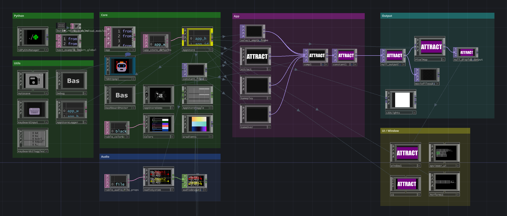

# haxlib

A personal toolkit for TouchDesigner software development.

## Notable code & tools

- `.ai/` 
  - Agentic tools and cross-harness sync for TouchDesigner projects
    - skills
    - prompts
    - mcp server config, specifically for [td-docs-mcp](https://github.com/cacheflowe/td-docs-mcp)
- `/python`
  - Reusable scripts (for chop/top script nodes) and general utilities
- `/scripts`
  - mostly shell scripts for project deployment and monitoring
- `/tox`
  - `/demo` - demo components for testing techniques and patterns
  - `/haxlib` - reusable TouchDesigner components for building networks programmatically
- `/www`
  - AppStore websocket server for multi-app sync and state management
  - web components and starting point for "show control" web UI